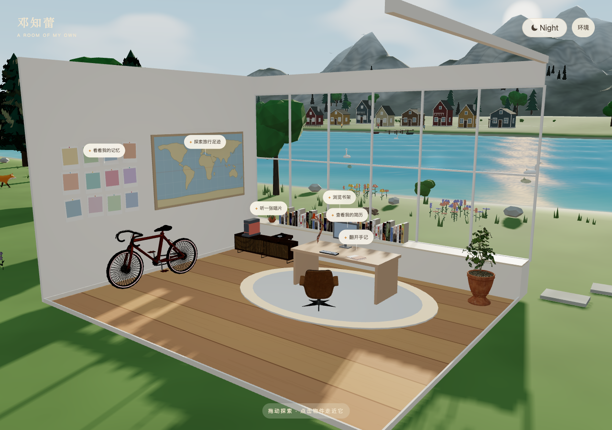

# Lake Room · Personal Digital World

中文名：湖畔 3D 个人数字世界

沿用原生 Three.js 房间，加入湖岸、松林、湖面、层叠远山、真实时间与四季配置、完整水平环绕，以及可持续管理内容的 Owner Studio。

这是一个 AI 辅助迭代的 3D 产品工程项目。作者负责体验方向、素材许可、场景约束和验收；AI 用于加速代码探索、视觉迭代与自动化测试。场景运行时由 Three.js、程序化环境系统和本地内容后端驱动，并非生成式 AI 渲染。

## 启动

`python3 backend/server.py` → http://127.0.0.1:8932/ ，管理入口 http://127.0.0.1:8932/admin/ 。也可双击 room-preview/打开房间预览.command。

首次密码在私有 `.room-data/owner-bootstrap.txt`，首次登录必须修改。操作和生产配置见 [Owner 使用说明](docs/OWNER-SETUP.md)。没有 npm 安装、TypeScript 或构建步骤。

## 模块

- room.js：室内场景、外部安全环绕、遮挡立面隐藏与渲染循环。
- world-state.js：独立时间与四季配置；自动本地时间、白天、黄昏、夜晚预览。
- world-surface.js：统一湖界、地形三角面采样、占地与路径断言。
- sun-rig.js / environment.js：统一太阳、真实近岸阴影、程序岩层、三档森林、湖面法线与四季。
- landscape-assets.js / village.js：原创程序素材、8 栋彩色木屋、码头、小船及远景行人。
- animal-system.js：本轮默认停用旧 primitive 动物；近景动物待有许可的 GLB 与动画资产。
- camera-controller.js / interaction-bubble.js / interactions.js：统一物件交互与发布内容更新。
- experiences.js / experience.css：六类暖色体验，包括竖版手账与 Travel Memory Map 明信片交互。
- content-schema.js / content-store.js：按物件定义字段，并适配公开 API 与显式静态模式。
- backend/server.py / schema.sql：真实 Owner 认证、SQLite、受保护媒体与内容 CRUD。
- room-preview/admin/：登录、上传、编辑、排序、公开／私有。

[当前环境重构与实测验收](docs/ENVIRONMENT-REFACTOR.md) · [历史视觉参考与产品架构判断](docs/TAHOE-IMPLEMENTATION.md) · [未来产品方向](docs/future-ideas.md) · [当前 Owner 与权限说明](docs/OWNER-SETUP.md)。旧 docs/CONTENT-AND-SECURITY.md 记录前一次静态版审计，当前后端实现以上述说明为准。

[版本演进](DEVELOPMENT_HISTORY.md) · [AI 协作与能力边界](docs/AI-DEVELOPMENT.md) · [素材来源与许可](docs/ASSET-LICENSES.md)

## 验证

`python3 tests/test_backend.py`；Node `--check` 检查 JS。Playwright 脚本 tests/admin-browser.cjs 与 tests/tahoe-browser.cjs 使用本机 Chrome，管理测试用隔离临时数据库，不修改个人内容。环境证据由 tests/environment-qa.cjs（固定机位截图、Metal 性能）与 tests/environment-contract.cjs（真实三角面、路径、阴影及交互）生成；独立空间测试为 tests/world-surface.cjs。

生产未部署新后端；旧 deploy-room.sh 仅发布静态预览。完整部署参考 backend/ 下的 systemd、Nginx 和环境变量模板。
